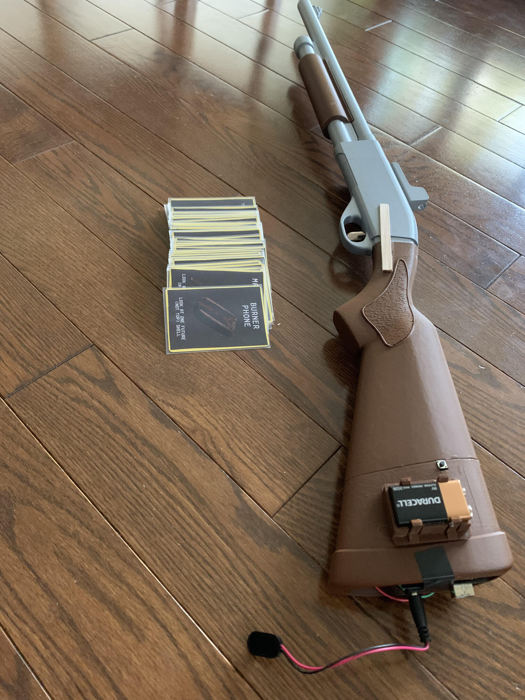

# BuckshotRoulette
Physically playable BuckshotRoulette with Arduino

# Materials 
- Arduino Uno
- 16x2 LCD display
- 3d printed remington shotgun
- Jumper Wires
- Small laptop/toy speaker
- 9v battery
- Resistors
- Transistor

# Notes 
Do not make any connection to digital A0 as it powers the random seed.
All credit goes to Mike Klubnika for the original game

